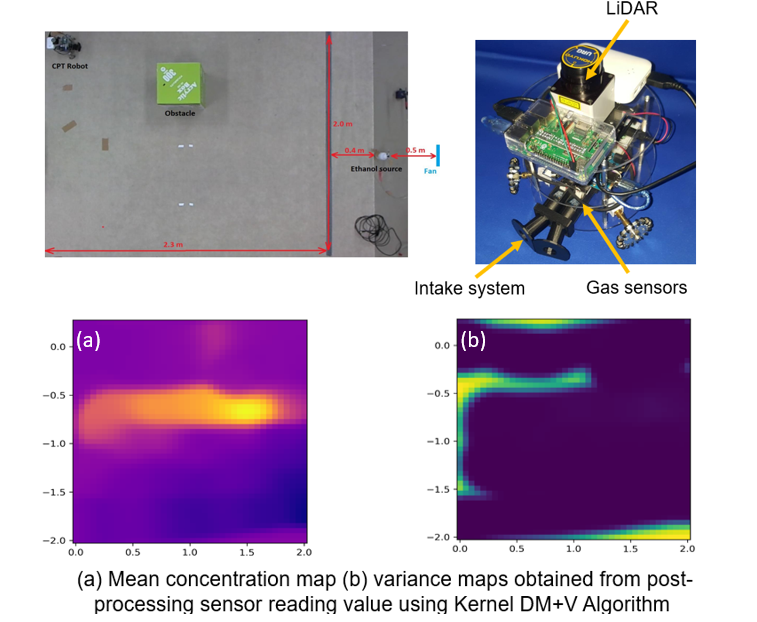

## Probabilistic mapping of gas distribution in a cluttered indoors environment.

During my summer exchange at Tokyo Institute of Technology, I conducted research on the Chemical Plume Tracing robot, integrating SLAM with chemical sensing to enhance gas tracking in complex indoor spaces. This aimed to enable real-time navigation and mapping of gas distribution.

I built a bio-inspired chemical tracing robot and used it to obtain the gas distribution map by offline-processing data from chemical sensing using the Kernel DM + V method.

### Images and Results:

  
  
(a) Mean gas concentration map (b) Gas concentration variance map obtained from post-processing sensor data using Kernel DM+V algorithm.

  
  
Experiment of gas concentration sampling while doing SLAM.

### Additional Information:
**Location**: Kurabayashi Laboratory, Tokyo Institute of Technology, Japan.  
**Date**: From 2019 June 1st to 2019 August 31st.  
**Context**: I was selected as an exchange student from Hanoi University of Science and Technology to join the Asia-Oceania Top University League on Engineering (AOTULE) program held at Tokyo Institute of Technology, Japan.

**Source code**: [GitHub Repository](https://github.com/nhat-14/Kernel_DM_V)