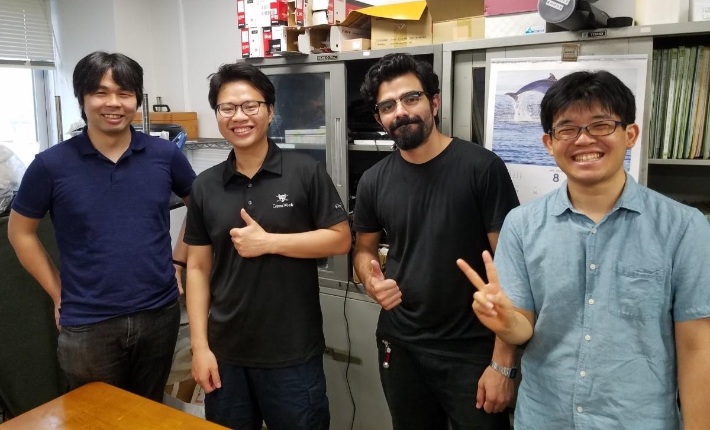

## Probabilistic mapping of gas distribution in a cluttered indoors environment

I conducted research on the Chemical Plume Tracing (CPT) robot, integrating SLAM with chemical sensing to enhance gas tracking indoor. This aimed to enable mapping of gas distribution. An Omnidirectional robot and used it to obtain the gas distribution map by offline-processing data from chemical sensing using the Kernel DM + V method.

**Problem statements**:
* Distribution of gas is dominated by turbulence.
* Long response time and long recovery time of gas sensors.
* Gas source is not always in an area with the highest gas concentration.
* A single measurement from sensor provides information about a very small area.
* Robot collects measurements from different areas but still able to infer the position of the source. 

### Images and Results:

  
  
(a) Mean gas concentration map (b) Gas concentration variance map obtained from post-processing sensor data using Kernel DM+V algorithm

  
  
Experiment of gas concentration sampling while doing SLAM

  
  
Me and people at Kurabayashi Laboratory

  
  
Me and other students in AOTULE program.

### Additional Information:
**Location**: Kurabayashi Laboratory, Tokyo Institute of Technology, Japan.  
**Date**: From 2019 June 1st to 2019 August 31st.  
**Context**: I was selected as an exchange student from Hanoi University of Science and Technology to join the Asia-Oceania Top University League on Engineering (AOTULE) program held at Tokyo Institute of Technology, Japan.  
**Reference**: [Kamarudin et al. (2018)](https://doi.org/10.1080/01691864.2018.1516568).  
**Source code**: [My GitHub Repository](https://github.com/nhat-14/Kernel_DM_V).  