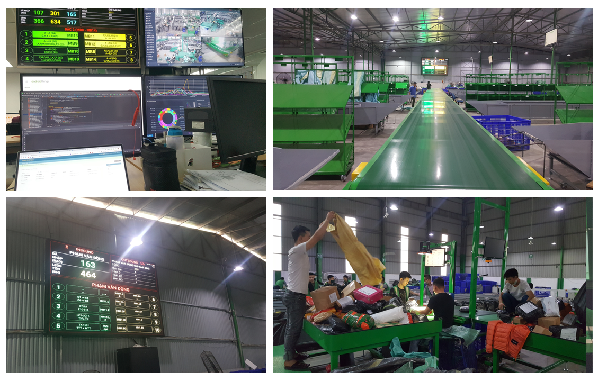
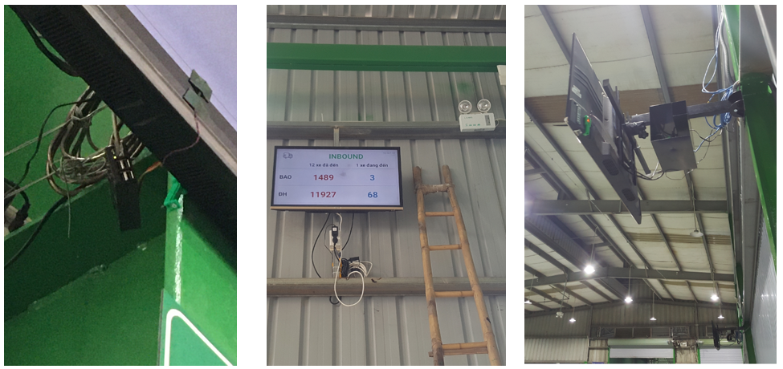
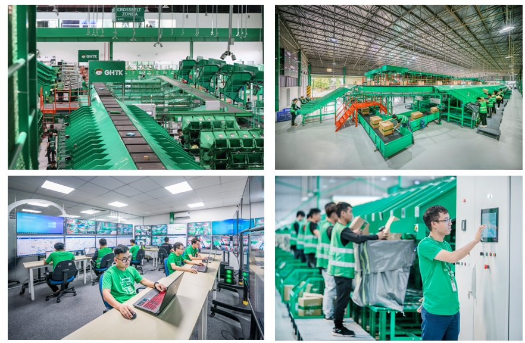

## Real-time WMS (Warehouse Management System) and WCS (Warehouse Control System).

At Giao Hang Tiet Kiem (GHTK), I developed a real-time data-assisted system for optimizing package handling and managing work shifts for workers and truck drivers in the E-commerce. This system, known as WMS (Warehouse Management System) and WCS (Warehouse Control System), underwent testing at the largest hub of company in northern Vietnam. 

Additionally, I designed and constructed auto-sorting conveyor system units that employed high-speed barcode readers to efficiently read package barcodes and accurately sort them based on their intended destinations. To provide a comprehensive visualization of the package sorting process, I developed Android applications compatible with mobile phones, TVs, and LED boards.

**Problem statements**:
* Packages were sorted manually.
* The number of packages, workers, and vehicles increased exponentially as the company grew.
* There was a need for automation and standardization for sorting process.

### Images and Results:

  
  
Semi-auto sorting system where packages are scanned by high-speed barcode readers at beginning and sorted mannually after

  
  
A display system using Android to show real-time information for warehouse workers. Information and on-off status are controlled from headquarter

  
  
The crossbelt system has been completed and is now being utilized

### Additional Information:
**Location**: Giao Hang Tiet Kiem (GHTK) Joint Stock Company, Hanoi, Vietnam.  
**Date**: From 2019 October 14th to 2020 September 20th.  
**Context**: I was a full-time employee at GHTK. I initially worked as an Automation Engineer for the first six months, but due to the COVID-19 pandemic, the development process was halted, and partnering with China became extremely difficult. I then moved to the IT department to work as a Back-end Engineer on the same project, preparing the software and infrastructure in advance for the WCS and WMS systems. I then end my career here after 1 year for higher education in Japan.  
**Reference**: https://giaohangtietkiem.vn/dua-cong-nghe-vao-van-hanh-toi-uu-thoi-gian-chia-chon-hang-hoa-tai-kho/