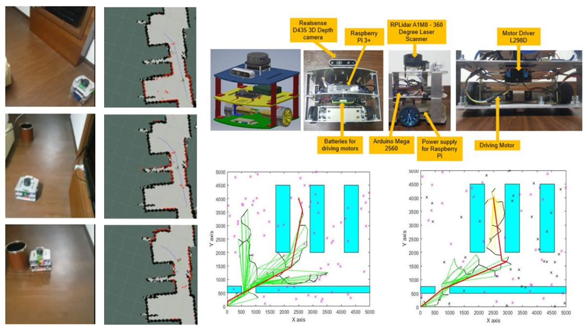

## Designing intelligent autonomous robot using the SLAM algorithm, RRT* algorithm, and Fuzzy-PID techniques

During my last years at Hanoi University of Science and Technology, I researched motion planning for autonomous mobile robots integrated with SLAM, RRT* algorithm, and Fuzzy-PID control techniques, aiming to create a robust and intelligent robot capable of autonomous navigation in an environment with obstacles.

**Problem statements**:
* Making path planner for RRT* algorithm.
* Bulding a mobile robot prototype which can navigate in obstacle region.

### Images and Results:

  
  
Robot and its planning algorithm.

### Additional Information:
**Location**: Hanoi University of Science and Technology, Vietnam.  
**Date**: From 2018 to 2019.  
**Context**: This is my bachelor's graduation thesis at Hanoi University of Science and Technology.  
**Reference**: [Mac et al. (2021)](http://dx.doi.org/10.12700/APH.18.6.2021.6.11).  
