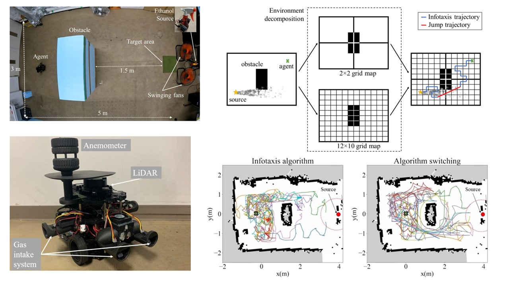

## Odor Source Localization in Obstacle Regions Using Switching Planning Algorithms with a Switching Framework

Odor source localization (OSL) robots are crucial for rescuing teams dealing with hazardous chemical plumes. Constructing the dispersion model of the odor plume for probabilistic odor source search algorithms is difficult due to the complex environment. In this study, I simplified the environment into sub-environments with different resolutions and proposed a framework that alternates between Infotaxis and Dijkstra algorithms to navigate the agent. This improved the success rate and reduced the average moving steps. Our implementation on an autonomous mobile robot verified its effectiveness. 

**Problem statements**:
* Testing and intergrating vision-based sensor for AGV.
* Setup CAN-bus for the AGV.

### Images and Results:

  
  
AGV prototypes were being assembled for testing with CAN bus, ultrasonic sensors, and cameras.

### Additional Information:
**Location**: Advanced Intelligent Robot Lab, National Taiwan University of Science and Technology, Taiwan.  
**Date**: From 2019 March to 2019 May.  
**Context**: This internship worked as a part of my bachelor's graduation thesis at Hanoi University of Science and Technology.  
**Reference**: [Luong et al. (2023)](https://www.mdpi.com/1424-8220/23/3/1140), [Luong et al. (2024)](https://doi.org/10.1080/18824889.2024.2374569).