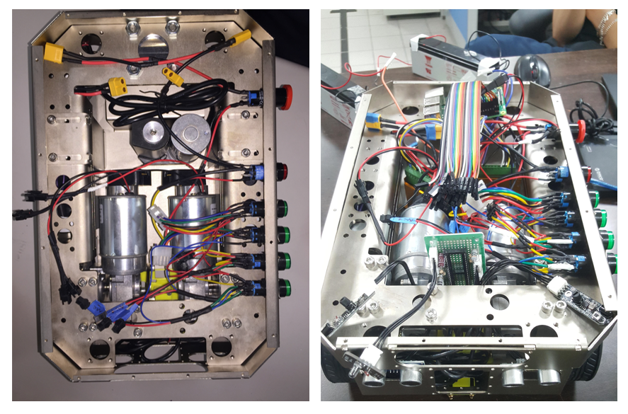

## Navigation of Automatic Guided Vehicles (AGV) using multiple vision-based algorithms

During my internship at National Taiwan University of Science and Technology (NTUST) in March - May 2019, I was part of the team responsible for designing an analog control system for an Automated Guided Vehicle (AGV) that could operate efficiently in industrial environments. Using CAN-bus technology, we were able to create a system that allowed for seamless communication between the AGV and its surrounding environment. This project was completed in collaboration with UBIQELIFE Technology Corporation. 

**Problem statements**:
* Testing and intergrating vision-based sensor for AGV.
* Setup CAN-bus for the AGV.

### Images and Results:

  
  
AGV prototypes were being assembled for testing with CAN bus, ultrasonic sensors, and cameras.

  
  
Me at National Taiwan University of Science and Technology.

### Additional Information:
**Location**: Advanced Intelligent Robot Lab, National Taiwan University of Science and Technology, Taiwan.  
**Date**: From 2019 March to 2019 May.  
**Context**: This internship worked as a part of my bachelor's graduation thesis at Hanoi University of Science and Technology.  
**Reference**: [Mac et al. (2021)](http://dx.doi.org/10.12700/APH.18.6.2021.6.11).  