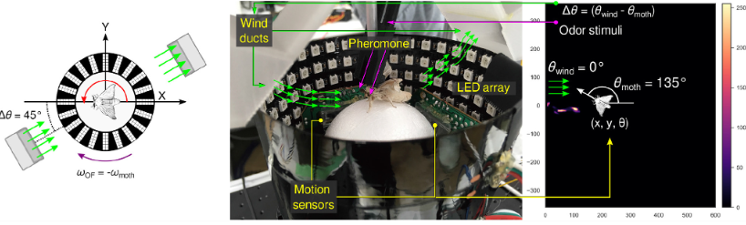

## Surpassing Natural Experts in Odor Source Localization Through Inverse Reinforcement Learning

I am using deep inverse reinforcement learning to learn the odor search strategy of the silkworm moth in nature and export a reward function from it to apply to the autonomous mobile robot for safety and rescue tasks. 

**Problem statements**:
* Finding gas source in obstacle region.
* Learning from natural expert which is silkworm moth.

### Images and Results:

  
  
VRmoth system for obtaining silkworrm moth behavior

  <video width="600" height="337" controls>
    <source src="images/switch_algorithm.mp4" type="video/mp4">
    Odor Source Localization with Switch planning algorithms framework in a more complex environment
  </video>

### Additional Information:
**Location**: Kurabayashi Laboratory, Tokyo Institute of Technology, Japan.  
**Date**: From 2022 October to 2025 September.  
**Context**: This is my PhD Dissertation at Institute of Science Tokyo.  
**Publications**: [Hernandez-Reyes et al. (2022)](https://doi.org/10.1109/TMRB.2021.3129113).