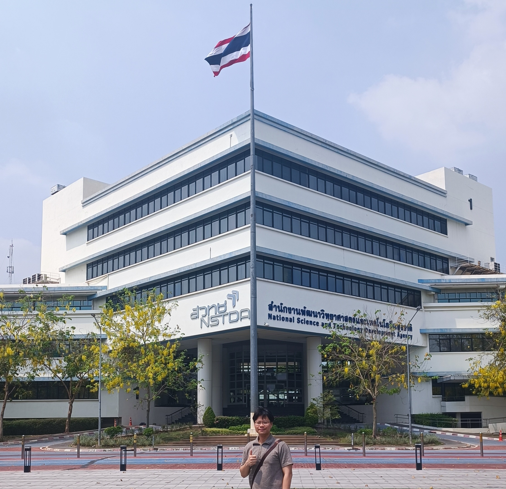
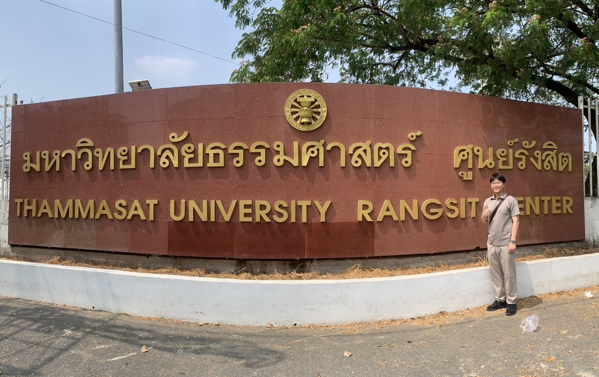

## A health monitoring IOT application

From 2025 March 01 to 2025 March 30, I went to Thailand as a exchange student to join TAIST-Tokyo Tech Student Exchange Program in Thailand 2024: Artificial Intelligence and Internet of Things (AIoT) Program. I participated in classes and group projects focused on embedded systems design. This AIoT program collaborates with the Thai government, the National Science and Technology Development Agency (NSTDA), Thammasat University, and Kasetsart University

A comprehensive course on IoT software application design, including multiple wireless communication, databases, containers, version control, machine learning, chatbots, and general AI, is compressed into a 1-month lecture-lab course. 

**Problem statements**:
This is a health monitoring application that tracks the status of gym trainers in real time. The system utilizes heart rate and motion sensors (IMU) to detect abnormal changes in trainers' physical health during workouts. The application advises trainers on modifying their training or taking a rest. In case of an accident, it functions as an SOS application, sending an SOS signal for help.

### Images and Results:

  
  
Me at National Science and Technology Development Agency.

  
  
Me at Thammasat University.

### Additional Information:
**Location**: National Science and Technology Development Agency, Thailand Science Park, Bangkok, Thailand.  
**Date**: From 2025 March 01 to 2025 March 30.  
**Context**: This exchange program happened during my last year of PhD in Institute of Science Tokyo.  
**Commited repository**: [Github](https://github.com/nhat-14/ict720-project).  