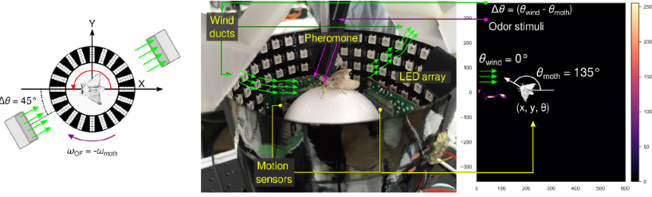

# Works and Publications 
---
## Using deep inverse reinforcement learning for gas source localization in obstructed environment.

I am using deep inverse reinforcement learning to learn the odor search strategy of the silkworm moth in nature and export a reward function from it to apply to the autonomous mobile robot for safety and rescue tasks. 

 

 

© 2022 Nhat Luong.
