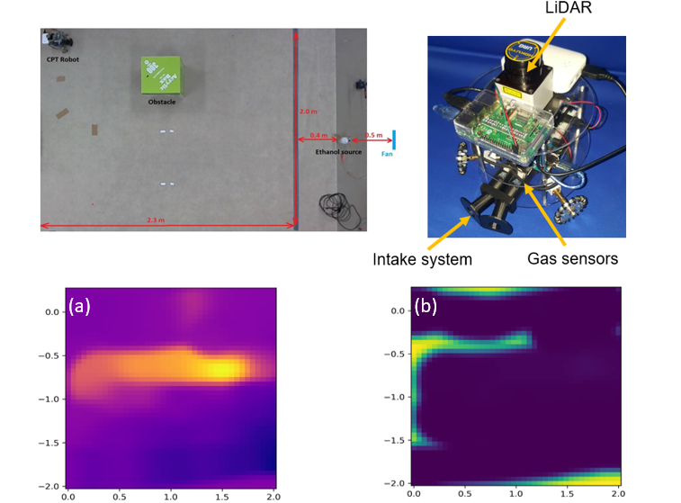

# Works and Publications 
---
## Using deep inverse reinforcement learning for gas source localization in obstructed environment.

I am using deep inverse reinforcement learning to learn the odor search strategy of the silkworm moth in nature and export a reward function from it to apply to the autonomous mobile robot for safety and rescue tasks. 

 

 

---

## Odor Source Localization in Obstacle Regions Using Switching Planning Algorithms with a Switching Framework

My research was published as an article in [***Sensors***](https://www.mdpi.com/1424-8220/23/3/1140) (January, 2022).

Odor source localization (OSL) robots are crucial for rescuing teams dealing with hazardous chemical plumes. Constructing the dispersion model of the odor plume for probabilistic odor source search algorithms is difficult due to the complex environment. In this study, I simplified the environment into sub-environments with different resolutions and proposed a framework that alternates between Infotaxis and Dijkstra algorithms to navigate the agent. This improved the success rate and reduced the average moving steps. Our implementation on an autonomous mobile robot verified its effectiveness. 

 

 

---
##  Developed real-time data-assisted system on package handling, work shifts for workers, truck drivers.

During my tenure at Giao Hang Tiet Kiem (GHTK, JSC) from October 2019 to September 2020, I executed a variety of tasks:

I developed a real-time data-assisted system for optimizing package handling and managing work shifts for workers and truck drivers in the E-commerce industry. This system, known as WMS (Warehouse Management System) and WCS (Warehouse Control System), underwent testing at the largest hub of a company located in northern Vietnam.

Additionally, I designed and constructed auto-sorting conveyor system units that employed high-speed barcode readers to efficiently read package barcodes and accurately sort them based on their intended destinations.
To provide a comprehensive visualization of the package sorting process, I developed Android applications compatible with mobile phones, TVs, and LED boards. These applications presented data related to the sorting process in an easily understandable and accessible format. 

 

 

---
##  Probabilistic mapping of gas distribution in a cluttered indoors environment.

During my summer exchange at Tokyo Institute of Technology, Japan from June to September 2019, I conducted reseach task:

I built a bio-inspired chemical tracing robot and use it to obtain the gas distribution map by offline-processing data from chemical sensing using the Kernel DM + V method. 

 

 

---
##  Designing intelligent autonomous robot using the SLAM algorithm, RRT* algorithm, and Fuzzy-PID techniques.

My research was published as an article in [***Acta Polytechnica Hungarica***](http://acta.uni-obuda.hu/Mac_Lin_Huan_Nhat_Hoang_Hai_113.pdf) (January, 2022).

I successfully applied my expertise in simultaneous localization and mapping (SLAM) and RRT* path planning algorithm to enable a mobile robot to efficiently navigate its surroundings by accurately defining its environment and determining its optimal path. 

 

 

---
##  Navigation of Automatic Guided Vehicles (AGV) using multiple vision-based algorithms.

During my internship at National Taiwan University of Science and Technology (NTUST) in March - May 2019, I was part of the team responsible for designing an analog control system for an Automated Guided Vehicle (AGV) that could operate efficiently in industrial environments. Using CAN-bus technology, we were able to create a system that allowed for seamless communication between the AGV and its surrounding environment. This project was completed in collaboration with the Center for Intelligent Robots (NTUST) and UBIQELIFE Technology Corporation.

 

 

---
## 3D model construction of mechanical and electronic components

 During my internship at DKS Production and Trading Co., Ltd in Vietnam from June to August 2018, I was responsible for creating 3D models of mechanical and electronic components using Computer-Aided Design software such as SolidWorks and AUTODESK Inventor. These models were used for both manufacturing and educational purposes, and my work helped to streamline the production process and improve overall efficiency. 

 

 

© 2022 Nhat Luong.
